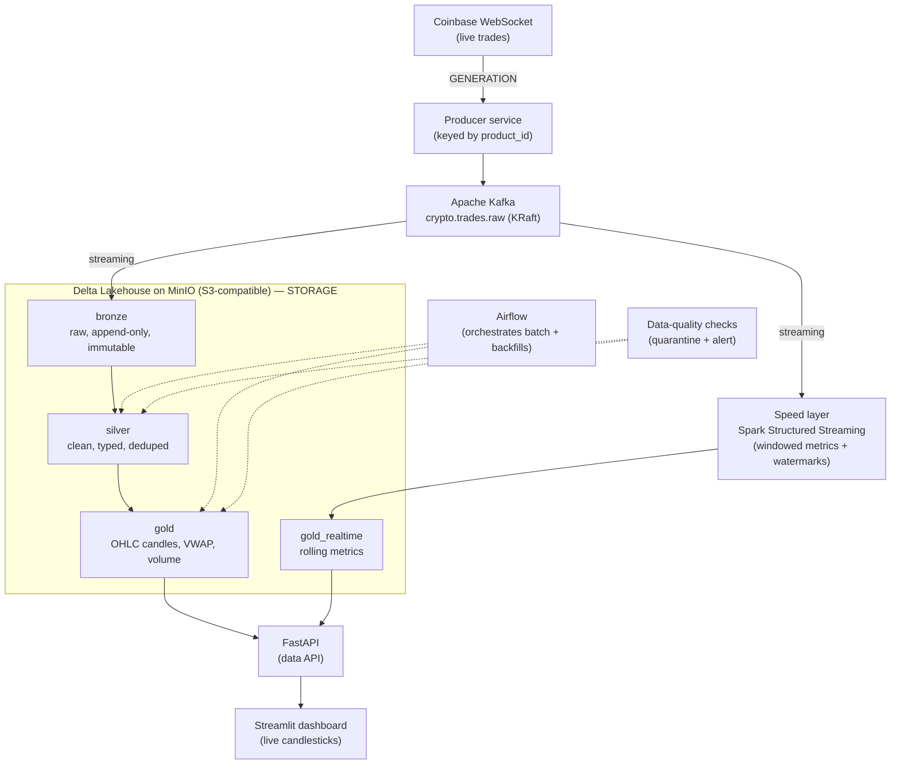

# Architecture

Real-time crypto market-data lakehouse: live Coinbase trades streamed through
Kafka, processed by Spark into a Delta Lake medallion on MinIO, orchestrated by
Airflow, served via FastAPI + a dashboard, and deployed on Kubernetes.

This document describes the **target** design and the reasoning behind it. Point
decisions (with alternatives) live in the [decisions log](./docs/adr/). Build
status is tracked at the bottom.

---

## 1. Design goals

1. **Exercise the full data-engineering lifecycle** — generation → ingestion →
   storage → processing → serving — end to end, for real (not stubbed).
2. **Be trustworthy, not just working** — data quality, idempotency,
   replay/backfill, schema management, observability, and tests are first-class,
   because that is what separates a platform from a demo.
3. **Reproducible & portable** — everything runs from `docker compose up`
   locally, and the same containers migrate to Kubernetes.
4. **Defensible tradeoffs** — every major choice has a documented rationale and
   the alternative we'd reach for under different constraints.

## 2. The lifecycle, mapped to components

| Stage | Component | What it does |
|---|---|---|
| Generation | Coinbase WebSocket `matches` feed | free, real, legal real-time trades |
| Ingestion | Apache Kafka (KRaft) | durable, replayable event log; producer/consumer decoupling |
| Storage | Delta Lake on MinIO | ACID tables (medallion bronze/silver/gold) on S3-compatible object storage |
| Processing | Spark (Structured Streaming + batch) | one engine for both the speed and batch paths |
| Serving | FastAPI + Streamlit | data API + live candlestick dashboard |
| Orchestration | Airflow | schedules/retries the batch layer + backfills |
| Deployment | Docker Compose → Kubernetes (+ Helm) | reproducible local stack → real orchestration |

The six *undercurrents* — security, data management, DataOps, architecture,
orchestration, software engineering — are addressed throughout (data contracts,
DQ, idempotency, CI, non-root containers, ADRs, etc.).

## 3. Data flow (target)

## 4. Why Lambda (speed + batch), not Kappa

We genuinely have two needs: **real-time** metrics (a live dashboard) *and*
**correct historical** aggregates that can be recomputed/backfilled. Lambda
serves both with two paths sharing one storage layer:

- **Speed layer** — Spark Structured Streaming computes low-latency windowed
  metrics (rolling VWAP, trade counts, short-window volatility) with watermarks
  for late data. Optimized for freshness; approximate is acceptable.
- **Batch layer** — Spark batch jobs build the immutable bronze → silver → gold
  medallion, and can reprocess any date range. Optimized for correctness and
  completeness.

Building **both** lets the project *demonstrate* the distinction rather than name
it. The tradeoff — Lambda's cost is maintaining two code paths — is real, so the
README/ADR also states **when we'd consolidate to Kappa**: if a single streaming
path with replay (from Kafka + Delta) could satisfy both latency and correctness
needs, the operational simplicity would win. Here, building both paths makes the
contrast demonstrable rather than theoretical. See
[ADR 0006](./docs/adr/0006-lambda-architecture.md).

## 5. The medallion (storage) model

- **Bronze** — raw trades exactly as ingested from Kafka, append-only and
  immutable, plus an ingestion timestamp. It is the **replay source** and audit
  record; everything else is derivable from it. (Even the two malformed test
  messages live here — bronze records the source faithfully, warts and all.)
- **Silver** — parsed, typed (prices/sizes as `Decimal`), standardized, and
  **deduplicated** on `(product_id, trade_id)` with a watermark. Malformed rows
  are dropped/quarantined. This is the trustworthy base for analytics.
- **Gold** — analytical products: OHLC candles + VWAP + volume per product per
  interval (the grain), plus a `gold_realtime` table from the speed layer.

Data-layout optimization (partitioning, `OPTIMIZE`/compaction, Z-ordering,
`VACUUM`, and an evaluation of liquid clustering) is applied and **measured** on
the gold tables — see ADRs
[0009](./docs/adr/0009-partitioning-strategy.md) and
[0010](./docs/adr/0010-zorder-vs-liquid-clustering.md).

## 6. Key cross-cutting properties

- **Data contract at the boundary** — a Pydantic `Trade` model formalizes the
  ingestion schema (types, invariants, `Decimal` money). See
  [ADR 0008](./docs/adr/0008-data-contract-pydantic.md).
- **Delivery semantics** — the producer is idempotent (`enable.idempotence` +
  `acks=all`); bronze ingestion will use streaming checkpoints + Delta atomic
  commits for **exactly-once** landing; batch jobs will be idempotent via
  MERGE/partition-overwrite so re-runs never duplicate.
- **Replayability** — Kafka retention + immutable bronze make backfills and
  reprocessing possible (and underpin the Kappa argument).
- **Security & ops** — containers run as non-root; secrets/config via env;
  structured logging and metrics for observability.

## 7. Deployment topology

- **Local:** `docker compose up` wires the whole stack on one Docker network.
  Kafka advertises a `HOST` listener (`localhost:9092`) for laptop tools and a
  `DOCKER` listener (`kafka:29092`) for in-network services.
- **Kubernetes (planned):** stateless apps (producer, API, dashboard) become
  Deployments; stateful backbone (Kafka, MinIO) become StatefulSets with
  PersistentVolumeClaims; config via ConfigMaps/Secrets; packaged with Helm.

## 8. Build status

| Milestone | Status |
|---|---|
| Live data flowing into Kafka, containerized, verified, documented | **complete** |
| Full Lambda pipeline end-to-end in Compose | **complete** |
| Production rigor: DQ, idempotency, replay, orchestration, observability, tests, CI | **complete** |
| Serving: FastAPI read API over gold (delta-rs, no Spark) | **complete** |
| Dashboard + Kubernetes deployment | pending |

**Implemented to date:** Spark + Delta + MinIO; bronze streaming ingestion
(exactly-once); silver parse/type/dedup; batch gold OHLC/VWAP candles;
speed-layer rolling metrics; date-partitioned gold + `OPTIMIZE`/Z-order/VACUUM
toolkit; data-quality checks with quarantine; idempotent MERGE writes + backfill;
Airflow batch + backfill DAGs; structured logging + a run-metrics table; a
JVM-free FastAPI serving API over the gold layer.
See [`docs/runbook.md`](./docs/runbook.md) and [`docs/serving.md`](./docs/serving.md).

## 9. Where to read more

- Feed study & market-data gotchas: [`docs/coinbase_websocket_schema.md`](./docs/coinbase_websocket_schema.md)
- Kafka setup & partition rationale: [`docs/kafka_setup.md`](./docs/kafka_setup.md)
- Data contract: [`docs/data_contract.md`](./docs/data_contract.md)
- End-to-end runbook: [`docs/runbook.md`](./docs/runbook.md)
- Serving API: [`docs/serving.md`](./docs/serving.md)
- Data layout & optimization: [`docs/data_layout.md`](./docs/data_layout.md)
- All decisions with alternatives: [`docs/adr/`](./docs/adr/)
