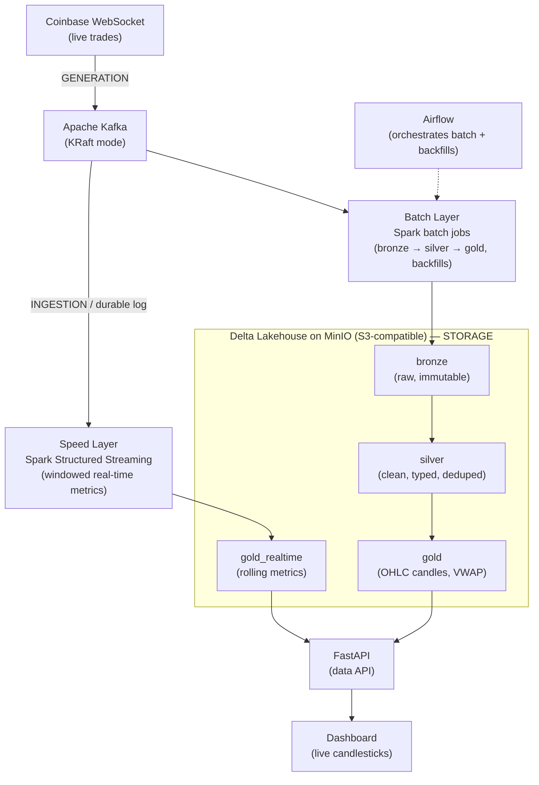

# Real-Time Crypto Market Data Lakehouse

[](https://github.com/pcallahandoescs/crypto_lakehouse/actions/workflows/ci.yml)

> A production-grade, end-to-end data platform: live crypto trades streamed from the
> Coinbase WebSocket, buffered through Kafka, processed by Spark into a Delta Lake
> medallion architecture on MinIO, orchestrated with Airflow, served via FastAPI +
> a live dashboard, and deployed on Kubernetes.

**Status:** Live trades flow Kafka → bronze → silver → gold, plus a real-time
speed layer — orchestrated with Airflow, covered by data-quality checks, and
observable via structured logs + a run-metrics table. The gold layer is served
over HTTP by a JVM-free [FastAPI](./docs/serving.md) API. See the
[runbook](./docs/runbook.md) to reproduce the stack.

Full design and the reasoning behind every choice:
[`ARCHITECTURE.md`](./ARCHITECTURE.md) · decisions log [`docs/adr/`](./docs/adr/) ·
[runbook](./docs/runbook.md).

---

## Why this project

It exercises all five data-lifecycle stages (generation → ingestion → storage →
processing → serving) and the engineering undercurrents that separate a real data
platform from a demo: **data quality, idempotency, replay/backfill, orchestration,
observability, testing, and containerized deployment**. It is built as a **Lambda
architecture** (a real-time speed layer *and* a correct batch layer) on purpose, so
the design tradeoffs — including *when you'd instead choose Kappa* — are demonstrable,
not just nameable.

## Architecture (target)



> This diagram is the target design; the dashboard and Kubernetes layers are
> still in progress. See [`ARCHITECTURE.md`](./ARCHITECTURE.md) for the full
> design, the Lambda rationale, and current build status.

## Tech stack

| Layer | Tool | Why |
|---|---|---|
| Source | Coinbase WebSocket | Free, real, legal real-time market data |
| Ingestion | Apache Kafka (KRaft) | Durable, replayable event log; decouples producers/consumers |
| Object storage | MinIO | Self-hosted, S3-compatible; portable to any cloud |
| Table format | Delta Lake | ACID + time-travel + schema enforcement on object storage |
| Processing | Spark / PySpark | One engine for both streaming and batch |
| Orchestration | Airflow | Industry-standard DAG orchestration for batch/backfills |
| Serving | FastAPI | Modern Python data API |
| Dashboard | Streamlit | Fastest path to a live, demoable chart |
| Containers | Docker + Compose | Reproducible local stack |
| Deployment | Kubernetes (kind) | Container orchestration: scaling, self-healing |

Alternatives considered for each choice are documented in the
[decisions log](./docs/adr/).

## Repository layout

```
producer/     # Coinbase WebSocket -> Kafka producer service
spark_jobs/   # Spark Structured Streaming + batch jobs (bronze/silver/gold)
airflow/      # DAGs orchestrating the batch layer + backfills
serving/      # FastAPI service serving the gold Delta tables via delta-rs (no Spark)
dashboard/    # Live candlestick dashboard
k8s/          # Kubernetes manifests / Helm chart
docs/         # Data schema, Kafka setup, data contract
docs/adr/     # Architecture Decision Records (the decisions log)
tests/        # Unit tests (transformations, DQ logic)
```

## Development

Requires [uv](https://docs.astral.sh/uv/) and Docker.

```bash
make install      # sync the virtualenv from pyproject + uv.lock
make check        # lint + format-check + typecheck + tests (the CI gate)
make test-spark   # JVM-backed Spark transformation/DQ tests (needs Java 17)
make serve        # run the FastAPI serving API against local MinIO
make hooks        # install pre-commit git hooks
```

Quality tooling: **ruff** (lint + format), **mypy** (strict typing), **pytest**.

Tests come in two tiers. The **fast gate** (`make check`, run on every push by
CI) covers pure-Python logic — the ingestion data contract and its schema-drift
behavior, the producer's ingest filter and structured logging, and the streaming
lag/latency math — with no JVM. The **Spark tier** (`make test-spark`) runs the
real bronze→silver transformation and the data-quality checks on a local
`SparkSession`; it's auto-skipped when PySpark isn't installed, so it never slows
the gate.

## Roadmap

- **Foundations & ingestion** — live data flowing into Kafka, containerized. **Done.**
- **Lakehouse & processing** — full Lambda pipeline end-to-end in Compose. **Done.**
- **Production rigor** — data quality, idempotency, replay, orchestration, observability, tests. **Done.**
- **Serving** — FastAPI read API over the gold layer (delta-rs, no Spark). **Done.**
- **Deployment** — live dashboard, Kubernetes + Helm. **Planned.**

## License

[MIT](./LICENSE)
