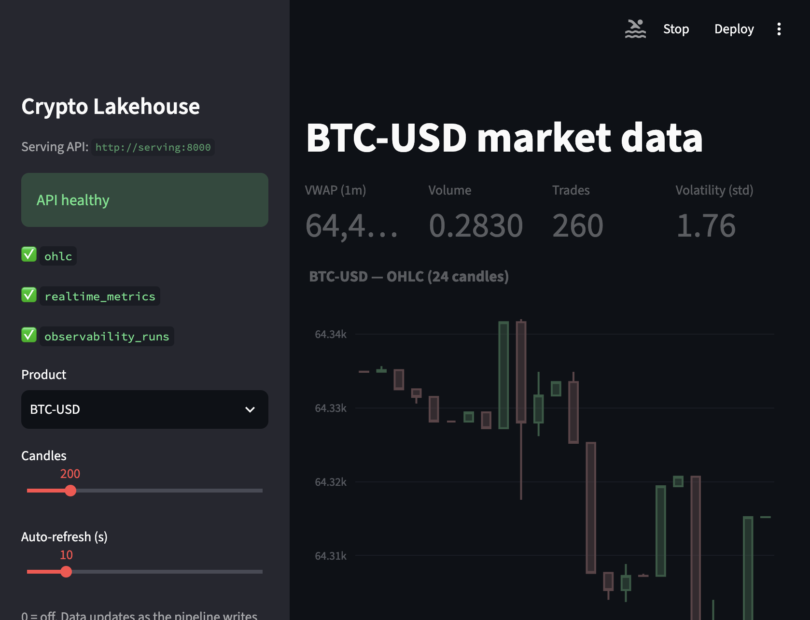
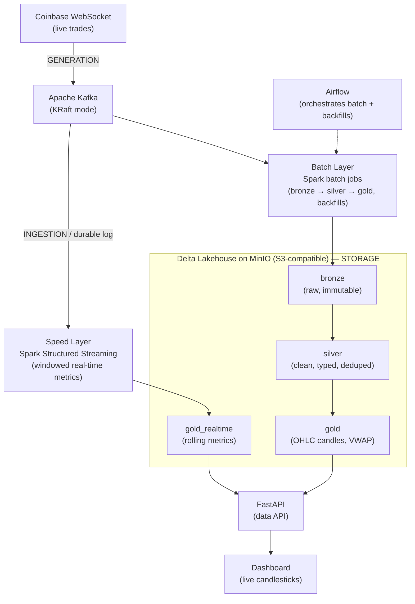

# Real-Time Crypto Market Data Lakehouse

[](https://github.com/pcallahandoescs/crypto_lakehouse/actions/workflows/ci.yml)

> An end-to-end data platform: live crypto trades streamed from the Coinbase
> WebSocket, buffered through Kafka, processed by Spark into a Delta Lake medallion
> on MinIO, orchestrated with Airflow, served over HTTP by FastAPI, and visualized
> in a live dashboard — the whole stack containerized and deployed on Kubernetes
> via a Helm chart.

**Status:** complete and running end-to-end. Live trades flow Kafka → bronze →
silver → gold, plus a real-time speed layer — orchestrated with Airflow, guarded by
data-quality checks, made safe to re-run (idempotency + replay/backfill), and
observable via structured logs and a run-metrics table. The gold layer is served
by a JVM-free FastAPI API and rendered in a Streamlit dashboard. It runs with one
command on Docker Compose *and* on Kubernetes (kind) via Helm.



*The live dashboard — real-time VWAP / volume / trade-count / volatility tiles and
an OHLC candlestick chart, reading the gold tables through the FastAPI serving API.*

---

## Contents

- [Why this project](#why-this-project)
- [Architecture](#architecture)
- [Lambda architecture — and when I'd choose Kappa](#lambda-architecture--and-when-id-choose-kappa)
- [The medallion (data model)](#the-medallion-data-model)
- [What makes it production-grade](#what-makes-it-production-grade)
- [Tech stack & tradeoffs](#tech-stack--tradeoffs)
- [Quickstart](#quickstart)
- [Repository layout](#repository-layout)
- [Development](#development)
- [Documentation](#documentation)
- [Future extensions](#future-extensions)
- [Build status](#build-status)

## Why this project

It exercises all five data-lifecycle stages — **generation → ingestion → storage →
processing → serving** — and the engineering undercurrents that separate a real
data platform from a demo: **data quality, idempotency, replay/backfill,
orchestration, observability, testing/CI, and containerized deployment.**

The hard parts are handled for real, not stubbed: exactly-once streaming ingestion,
schema enforcement with a proven evolution path, MERGE-based idempotent writes,
date-range backfills off immutable bronze, and a Compose→Kubernetes migration
packaged as a Helm chart. Every significant choice is captured with its tradeoffs
in an [Architecture Decision Record](./docs/adr/).

## Architecture


```mermaid
flowchart TD
    CB["Coinbase WebSocket<br/>(live trades)"] -->|GENERATION| K["Apache Kafka<br/>(KRaft mode)"]
    K -->|INGESTION / durable log| SPEED["Speed Layer<br/>Spark Structured Streaming<br/>(windowed real-time metrics)"]
    K --> BATCH["Batch Layer<br/>Spark batch jobs<br/>(bronze → silver → gold, backfills)"]

    subgraph LAKE["Delta Lakehouse on MinIO (S3-compatible) — STORAGE"]
        BRONZE["bronze<br/>(raw, immutable)"] --> SILVER["silver<br/>(clean, typed, deduped)"] --> GOLD["gold<br/>(OHLC candles, VWAP)"]
        GOLD_RT["gold_realtime<br/>(rolling metrics)"]
    end

    SPEED --> GOLD_RT
    BATCH --> BRONZE
    GOLD --> API["FastAPI<br/>(data API)"]
    GOLD_RT --> API
    API --> DASH["Dashboard<br/>(live candlesticks)"]

    AIRFLOW["Airflow<br/>(orchestrates batch + backfills)"] -.-> BATCH
```

Live trades cross the generation→ingestion boundary into Kafka, which is the
durable, replayable buffer that decouples the producer from every consumer. From
there the pipeline forks into the two Lambda paths, both landing in the Delta
lakehouse on MinIO. The gold tables are the analytical product; FastAPI reads them
directly (via `delta-rs`, no Spark on the read path) and the dashboard renders
them. Airflow orchestrates the batch layer and backfills.

See [`ARCHITECTURE.md`](./ARCHITECTURE.md) for the full design and rationale.

## Lambda architecture — and when I'd choose Kappa

The project has two genuinely different consumer needs: **low-latency** real-time
metrics (the live dashboard) and **correct, complete** historical aggregates that
can be recomputed and backfilled. Those optimize for different things — freshness
vs. correctness — so it's built as a **Lambda architecture**:

- **Speed layer** — Spark Structured Streaming with sliding windows + watermarks
  → `gold_realtime`, for fresh metrics that tolerate small late-data corrections.
- **Batch layer** — Spark batch (bronze → silver → gold) for authoritative
  historical candles, reprocessable on demand.

Building both *demonstrates* the distinction rather than merely naming it. The
well-known cost is two code paths to maintain.

**When I'd choose Kappa instead:** if a single streaming job with log replay could
meet both the latency *and* correctness needs, I'd consolidate to Kappa to drop the
dual maintenance — reprocessing becomes "replay the Kafka log / immutable bronze
through the one path." The building blocks for that consolidation (Kafka retention
+ immutable bronze) already exist here; Lambda is a deliberate choice to exercise
both paths. Full reasoning in [ADR 0006](./docs/adr/0006-lambda-architecture.md).

## The medallion (data model)

| Layer | Grain | Contents | Guarantees |
|---|---|---|---|
| **bronze** | one row per trade | raw Coinbase trades as-ingested + ingestion timestamp | append-only, immutable — the replay source; exactly-once from streaming checkpoints + Delta atomic commits |
| **silver** | one row per trade | parsed, typed, standardized, **deduplicated** (trade key + watermark); malformed rows quarantined | schema **enforced** on write, additive **evolution** via `mergeSchema` |
| **gold** | one row per product per interval | **OHLC** candles, **VWAP**, volume, trade count; partitioned by date | idempotent MERGE/overwrite — re-running never duplicates |
| **gold_realtime** | one row per product per window | rolling VWAP, trade count, short-window volatility | speed-layer output; watermarked for late data |

Details: [bronze](./docs/bronze_ingest.md) · [silver](./docs/silver_transform.md) ·
[gold](./docs/gold_aggregate.md) · [speed layer](./docs/speed_layer.md) ·
[data layout & optimization](./docs/data_layout.md).

## What makes it production-grade

These are the parts that can't be faked, each built for real and documented:

- **Data quality** — null/key, uniqueness, schema, row-count-vs-prior, freshness,
  and value-range checks; failures **quarantine** bad rows and alert.
  → [`docs/data_quality.md`](./docs/data_quality.md)
- **Idempotency** — batch writes use MERGE/partition-overwrite on deterministic
  keys; re-running a job yields identical output (proven, no duplicates).
  → [`docs/idempotency.md`](./docs/idempotency.md)
- **Backfill & replay** — reprocess any date range off immutable bronze via a
  parameterized job/DAG — the "replay the log" idea made concrete.
  → [`docs/backfill.md`](./docs/backfill.md)
- **Orchestration** — Airflow DAGs (silver → gold → DQ) with dependencies,
  retries, and a separate parameterized backfill DAG.
  → [`docs/airflow.md`](./docs/airflow.md)
- **Observability** — structured JSON logs, a Delta **run-metrics** table, and
  streaming lag/latency tracking, mapped to the five pillars (freshness, volume,
  schema, lineage, quality). → [`docs/observability.md`](./docs/observability.md)
- **Data layout & optimization** — partitioning + pruning, `OPTIMIZE`/compaction,
  Z-ordering with data-skipping, `VACUUM`, and a reasoned liquid-clustering view,
  with before/after measurements. → [`docs/data_layout.md`](./docs/data_layout.md)
- **Tests + CI** — a two-tier suite (fast pure-Python gate + JVM-backed Spark
  tier) run by GitHub Actions on every push, with a green badge above.
- **Deployment** — Compose for dev, Kubernetes (kind) for the deployment
  showcase, packaged as a Helm chart with resource requests/limits and health
  probes. → [`docs/kubernetes.md`](./docs/kubernetes.md)

## Tech stack & tradeoffs

| Layer | Choice | Why | Alternative considered |
|---|---|---|---|
| Source | Coinbase WebSocket | Free, real, legal real-time market data (crypto avoids equity-data licensing) | Binance WS; a simulated feed |
| Ingestion | Apache Kafka (KRaft) | Durable, replayable log; decouples producers/consumers; KRaft drops ZooKeeper | Redpanda; Kinesis (cloud) |
| Object storage | MinIO | Self-hosted, S3-compatible; portable to any cloud | S3 / GCS / ADLS |
| Table format | Delta Lake | ACID + time-travel + schema enforcement on object storage | Iceberg; Hudi |
| Processing | Spark / PySpark | One engine for streaming *and* batch | Flink (stream-native); dbt (SQL) |
| Orchestration | Airflow | Industry-standard DAGs, retries, backfills | Dagster / Prefect |
| Serving | FastAPI + `delta-rs` | Modern Python API; reads Delta with no JVM/Spark on the hot path | Flask; Trino/Presto |
| Dashboard | Streamlit + Plotly | Fastest path to a live, demoable chart | React + Plotly |
| Containers | Docker + Compose | Reproducible local stack | — |
| Deployment | Kubernetes (kind) + Helm | Real orchestration: self-healing, scaling, one-command deploy | Cloud K8s (EKS/GKE) |

Every row is expanded with full context in the [decisions log](./docs/adr/).

## Quickstart

**Prerequisites:** Docker Desktop (give it 6–8 GB RAM), and [uv](https://docs.astral.sh/uv/)
for local Python tooling.

### Run on Docker Compose

```bash
# Backbone + producer (live trades start flowing into Kafka)
docker compose up -d kafka minio producer createbuckets
./scripts/create_topics.sh

# Batch medallion: bronze -> silver -> gold
for job in bronze_ingest silver_transform gold_aggregate; do
  docker compose run --rm spark \
    /opt/spark/bin/spark-submit --master "local[*]" --driver-memory 2g $job.py
done

# Serving API + dashboard
docker compose up -d serving dashboard
```

Then open the dashboard at <http://localhost:8501> and the API docs at
<http://localhost:8000/docs>. Full step-by-step (including the speed layer and
Airflow) is in the [runbook](./docs/runbook.md).

### Run on Kubernetes (kind + Helm)

```bash
# 1. Create the local cluster (stop Compose first — it holds the same host ports)
kind create cluster --config k8s/kind-cluster.yaml

# 2. Build the app images and load them into the cluster (no registry needed)
docker build -f producer/Dockerfile   -t crypto-lakehouse-producer:0.1.0  .
docker build -f serving/Dockerfile    -t crypto-lakehouse-serving:0.1.0   .
docker build -f dashboard/Dockerfile  -t crypto-lakehouse-dashboard:0.1.0 .
docker build -f spark_jobs/Dockerfile -t crypto-lakehouse-spark:3.5.3     .
for img in producer:0.1.0 serving:0.1.0 dashboard:0.1.0 spark:3.5.3; do
  kind load docker-image crypto-lakehouse-$img --name crypto-lakehouse
done

# 3. One-command deploy of the whole stack
helm install crypto-lakehouse helm/crypto-lakehouse --namespace crypto --create-namespace
kubectl -n crypto get pods -w
```

Same URLs (kind maps the host ports). Details, the Compose→K8s mapping, and Helm
values are in [`docs/kubernetes.md`](./docs/kubernetes.md).

## Repository layout

```
producer/     # Coinbase WebSocket -> Kafka producer service
spark_jobs/   # Spark Structured Streaming + batch jobs (bronze/silver/gold + DQ)
airflow/      # DAGs orchestrating the batch layer + backfills
serving/      # FastAPI service reading the gold Delta tables via delta-rs (no Spark)
dashboard/    # Streamlit + Plotly UI over the serving API (candlesticks + metrics)
k8s/          # Kubernetes manifests (kind cluster + StatefulSet backbone + app tier)
helm/         # Helm chart: one-command deploy with resource limits + probes
docs/         # Architecture docs, per-component deep dives, and the decisions log
docs/adr/     # Architecture Decision Records (the why behind every choice)
tests/        # Two-tier test suite (pure-Python gate + JVM-backed Spark tier)
```

## Development

```bash
make install      # sync the virtualenv from pyproject + uv.lock
make check        # lint + format-check + typecheck + tests (the CI gate)
make test-spark   # JVM-backed Spark transformation/DQ tests (needs Java 17)
make serve        # run the FastAPI serving API against local MinIO
make dashboard    # run the Streamlit dashboard against the serving API
make hooks        # install pre-commit git hooks
```

Quality tooling: **ruff** (lint + format), **mypy** (strict typing), **pytest**.

Tests come in two tiers. The **fast gate** (`make check`, run on every push by CI)
covers pure-Python logic — the ingestion data contract and its schema-drift
behavior, the producer's ingest filter and structured logging, and the streaming
lag/latency math — with no JVM. The **Spark tier** (`make test-spark`) runs the
real bronze→silver transformation and the data-quality checks on a local
`SparkSession`; it's auto-skipped when PySpark isn't installed, so it never slows
the gate.

## Documentation

- **Design:** [`ARCHITECTURE.md`](./ARCHITECTURE.md) · decisions log [`docs/adr/`](./docs/adr/)
- **Run it:** [runbook](./docs/runbook.md) · [Kubernetes + Helm](./docs/kubernetes.md)
- **Pipeline:** [bronze](./docs/bronze_ingest.md) · [silver](./docs/silver_transform.md) · [gold](./docs/gold_aggregate.md) · [speed layer](./docs/speed_layer.md)
- **Rigor:** [data quality](./docs/data_quality.md) · [idempotency](./docs/idempotency.md) · [backfill/replay](./docs/backfill.md) · [observability](./docs/observability.md) · [data layout](./docs/data_layout.md)
- **Serving:** [FastAPI API](./docs/serving.md) · [dashboard](./docs/dashboard.md)
- **Foundations:** [data contract](./docs/data_contract.md) · [Kafka setup](./docs/kafka_setup.md) · [MinIO setup](./docs/minio_setup.md) · [Spark+Delta+MinIO](./docs/spark_delta_minio.md)

## Future extensions

- **Consolidate toward Kappa** — collapse the batch path into the streaming one
  with log replay if a single path can meet both latency and correctness needs.
- **Cloud deployment + Terraform** — provision a managed cluster (EKS/GKE) and
  object store (S3/GCS) with IaC, swapping MinIO for cloud storage behind the same
  S3 API.
- **Native Spark-on-K8s** — run executors as separate pods (cluster mode) instead
  of `local[*]`, and move Airflow orchestration onto the cluster.
- **Iceberg comparison** — evaluate Apache Iceberg against Delta for the table
  format, with a migration note.
- **Crypto news / sentiment slice** — an alt-data NLP feed joined to price windows
  as a second source.

## Build status

| Milestone | Status |
|---|---|
| Live data flowing into Kafka, containerized, documented | **complete** |
| Full Lambda pipeline end-to-end in Compose | **complete** |
| Production rigor: DQ, idempotency, replay, orchestration, observability, tests, CI | **complete** |
| Serving: FastAPI read API over gold (delta-rs, no Spark) | **complete** |
| Dashboard: live Streamlit + Plotly UI over the serving API | **complete** |
| Kubernetes deployment (kind): full stack running (backbone + app tier) | **complete** |
| Kubernetes production hardening (resources, probes) + Helm chart | **complete** |

## License

[MIT](./LICENSE)
